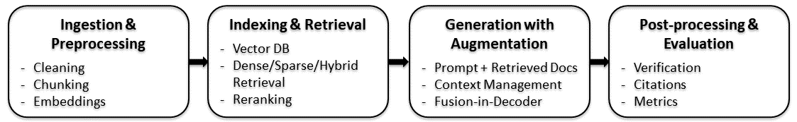

# Retrieval-Augmented Generation (RAG)

This project aims to explore the Retrieval Augmented Generation (RAG) technology. 

## What is RAG?

RAG is an AI framework that combines information retrieval with text generation. It brings our own data to Language Models (LMs) in order to enhance their capabilities. In particular, instead of relying only on a pre-trained LM, RAG retrieves relevant documents from an external knowledge base (e.g., database, vector store, or search engine) and uses them to ground the model's responses.

**Use Cases**:

RAG can be applied for many scenarios:
- Question Answering (QA): Customer support, knowledge base queries, healthcare FAQs.
- Document Search & Summarization: Research papers, legal documents, compliance checks.
- Chatbots & Virtual Assistants: More accurate and up-to-date answers.
- Enterprise Applications: Finance, law, or scientific domains where correctness matters.

**Importance**:
Language Models (LMs) exist some limitations:

- Outdated knowledge: LMs are typically trained on public data up to a certain date, leading to the lack of updated information.
- Missing internal knowledge: Companies typically have lots of valuable documents that are outside of the reach of LMs.

RAG is designed to address the above shortcomings with the following advantages:

- Up-to-date knowledge: Goes beyond the model’s training cutoff.
- Accuracy & reliability: Reduces hallucinations by grounding answers in real data.
- Domain adaptation: Tailors general LMs to specialized fields (medicine, law, etc.).
- Efficiency: Avoids retraining large models — just update the knowledge base.

# Pipeline and Techniques

A typical RAG pipeline has 4 main stages:

**1. Document Ingestion & Preprocessing**

Raw data (PDFs, web pages, reports, knowledge bases) is collected and prepared for search.
- Text Cleaning: remove noise (HTML tags, symbols).
- Chunking: split long documents into smaller and focused passages so that LMs and retrievers work better.
- Embedding Generation: convert each chunk into a numerical vector to enable semantic similarity search instead of just keyword matching.

**2. Indexing & Retrieval**

Store embeddings in a fast, searchable system. When a user asks a question, the system retrieves the most relevant chunks.

- Vector Databases: store embeddings and enable fast similarity search (using Approximate Nearest Neighbor algorithms).
- Retrieval Methods:
    - Dense Retrieval (embedding similarity): captures semantic meaning.
    - Sparse Retrieval (BM25, TF-IDF): captures exact keywords.
    - Hybrid Retrieval: combines both to improves accuracy since some queries need exact terms (like dates/numbers), others need semantic understanding.
- Reranking: reorder retrieved passages based on deeper context matching to improve precision by pushing the best passages to the top.

**3. Generation with Augmentation**

The query and retrieved documents are fed into LLMs to generate a grounded answer.

- Prompt Engineering: insert retrieved chunks into the LLM prompt (e.g., "Answer based only on the documents below…") to reduce hallucination.
- Context Window Management: summarization or sliding windows if retrieved documents exceed token limits since LLMs have context length limits.
- Fusion-in-Decoder (FiD): model attends to multiple retrieved documents and decides relevance to ensure it uses evidence effectively instead of relying on a single passage.

**4. Post-processing & Evaluation**

Ensure the generated answer is reliable and useful.

- Answer Verification: compare output against sources to check correctness to prevent hallucination.
- Citation Linking: attach sources to answers to build trust and transparency.
- Evaluation Metrics:
    - Relevance: does it answer the query?
    - Faithfulness: is it grounded in sources?
    - Coverage: does it use all necessary infomation?
- Optional Re-query / Feedback loop: retry retrieval if first results are weak.

# RAG in The Cloud

When deploying RAG solutions in the cloud, several key considerations come into play to ensure optimal performance, security, and cost-effectiveness:
- Performance: Efficient document ingestion, indexing, and retrieval.
- Security & Compliance: Access control, encryption, auditability.
- Integration: How well the cloud's AI services interconnect.
- Cost-effectiveness and operational scalability.

These factors guide the evaluation across Amazon Web Services (AWS), Microsoft Azure, and Google Cloud Platform (GCP).

**Cloud-by-Cloud Comparison**

| **Cloud Platform** | **Highlights** |
| -------------- | ----------------------------------------------------------------------------------------------------- |
| **AWS**        | Greatest flexibility; highly scalable; strong ML ecosystem (Bedrock, Kendra, Lambda, etc.)            |
| **Azure**      | Deep integration with Microsoft stack; strong governance and security; great for enterprise scenarios |
| **GCP**        | Simplified RAG workflow via Vertex AI; cost-effective, serverless-first deployments                   |

- AWS:
    - Offers high flexibility with services like Amazon Bedrock (for embeddings and LLMs) and Amazon Kendra (for enterprise search).
    - Integrates effectively with orchestration components like Lambda and DynamoDB.
    - Strong in scalability, security, and cost optimization for large-scale RAG deployments.

- Azure:
    - Seamlessly integrates Azure Cognitive Search (AI search/indexing) with Azure OpenAI.
    - Ideal for organizations already embedded in the Microsoft ecosystem due to strong security, ease of integration, and enterprise-friendly features.

- GCP:
    - Offers a streamlined RAG experience via Vertex AI, including the RAG Engine for simplified model integration.
    - Known for serverless deployment ease and cost efficiency, especially for teams prioritizing scalability and simplified operations.

# Building a RAG system with Azure OpenAI and Azure AI Search

**1. What are Microsoft Azure, Azure OpenAI, and Azure AI Cognitive Search?**
- Microsoft Azure is a cloud platform offering compute, storage, databases, AI, and networking services for building and running applications at scale.
- Azure OpenAI Service provides access to OpenAI's models (GPT-4/5, GPT-4o, embeddings, etc.) on Azure infrastructure with enterprise security, compliance, and integration.
- Azure AI Cognitive Search (now Azure AI Search) is a cloud search service that lets you index, search, and retrieve structured and unstructured content. It combines keyword search, semantic search, and vector search into a single service.

**2. RAG with Azure OpenAI + AI Search in Python**

To build a RAG system with Microsoft Azure in Python, we first create the following Azure resources using the Azure portal or Azure Cloud Shell:
- In Azure AI Foundry, create an AI Hub to organize projects.
- Azure OpenAI: Deploy a chat/completions model (e.g., GPT-5/GPT-4.1 family) and an embeddings model (text-embedding-3-large/-3-small...).
- Azure AI Search: Create a document search database with support for vectorization.

## References

- [RAG Course (DeepLearning.AI)](https://www.deeplearning.ai/courses/retrieval-augmented-generation-rag/)
- [RAG in The Cloud](https://ragaboutit.com/rag-in-the-cloud-comparing-aws-azure-and-gcp-for-deploying-retrieval-augmented-generation-solutions/)
- [RAG in Azure](https://www.udemy.com/course/rag-azure/?srsltid=AfmBOopllP1u1rFr7lPo57zgQZU-igkB3-yKjzveLY8uwyStl89nfWZ0)