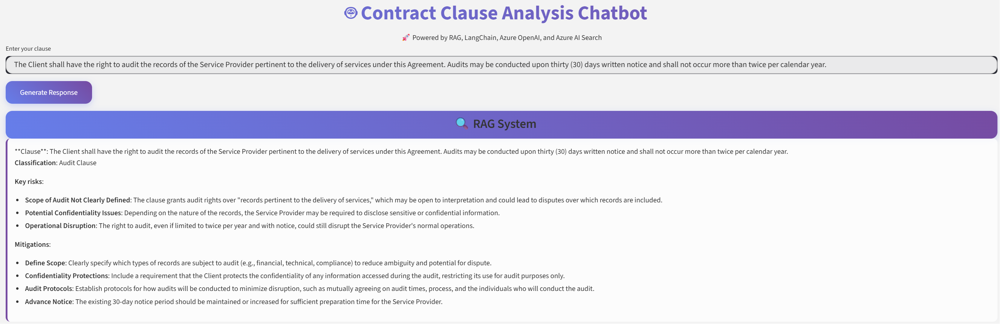

# ClauseGuard — Automated Contract Clause Classification & Risk Advice
### Powered by RAG, Langchain, Azure OpenAI, and Azure AI Search

## Objective

In prior work ([repo link](https://github.com/DucDungTran/NLP/tree/main/Contract-clause-analysis-chatbot)), contract-clause classifiers were developed by fine-tuning LegalBERT and RoBERTa, and a risk-advisory chatbot was implemented using a GPT model via the OpenAI API. This project leverages retrieval-augmented generation (RAG) with LangChain, Azure OpenAI, and Azure AI Search to enhance grounding and relevance. In particular, an european contract law book ([source link](https://www.legiscompare.fr/web/IMG/pdf/CFR_I-XXXIV_1-614.pdf)) is utilized to provide specific knowledge base for LLM models.

## Prerequisites

The following Azure resources are required to carry out this project:
- Azure OpenAI with two models: GPT-4.1 and Embedding model (text-embedding-3-large).
- Azure AI Search.

The RAG implementation in cloud can be found in [this repo](https://github.com/DucDungTran/RAG/tree/main/rag-cloud).

In this project, a RAG framework is developed via Langchain, Azure OpenAI and AI Search. The fine-tuned LegalBERT model performed in the prior work is then loaded to classify given contract clauses. After that, the clauses and respective classification results are fed into the RAG-based LLM model for risk analysis.

## Models
- [Fine-tuned LegalBERT](https://github.com/DucDungTran/NLP/tree/main/Contract-clause-analysis-chatbot): domain-specific BERT trained on legal corpora; excels on legal tasks due to in-domain pretraining. 
- GPT-4.1 via Azure OpenAI: generates risk narratives and mitigation steps from the classifier outputs, raw clause text, and provided context.
- Embedding model - OpenAI text-embedding-3-large: produces high-quality vector embeddings for semantic search and RAG.

## Technologies
- Python: core language.
- Hugging Face Transformers / PyTorch: load & fine-tune encoders, inference pipelines.
- RAG: embed data chunks -> retrieve top-k relevant chunks -> augmented prompt for answer quality improvement.
- Langchain: a popular framework for implementing seamless RAG workflows.
- Azure OpenAI: Microsoft's managed service that provide API access to OpenAI models (e.g., GPT-5, GPT-4.1, embeddings).
- Azure AI Search: Microsoft's managed search service for building retrieval over your own data, often used as the retrieval layer in RAG applications.
- Streamlit — lightweight chat UI for interactive reviews.

## Demo (Streamlit):

Paste a clause in the chat. The tool returns:
- Clause classification result,
- Key risks & short rationale (GPT-4.1),
- Practical mitigation steps.

## References
- [RAG Course](https://www.deeplearning.ai/courses/retrieval-augmented-generation-rag/)
- [RAG in Azure](https://www.udemy.com/course/rag-azure/?srsltid=AfmBOopllP1u1rFr7lPo57zgQZU-igkB3-yKjzveLY8uwyStl89nfWZ0)
- [Langchain Azure OpenAI](https://python.langchain.com/docs/integrations/llms/azure_openai/)
- [Langchain Azure AI Search](https://python.langchain.com/docs/integrations/vectorstores/azuresearch/#configure-vector-store-settings)
- [Streamlit](https://streamlit.io/)